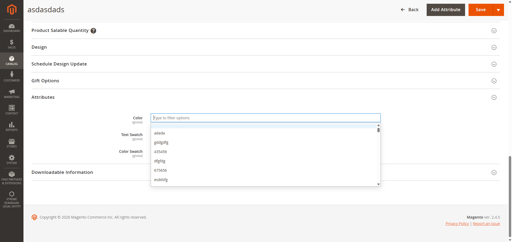
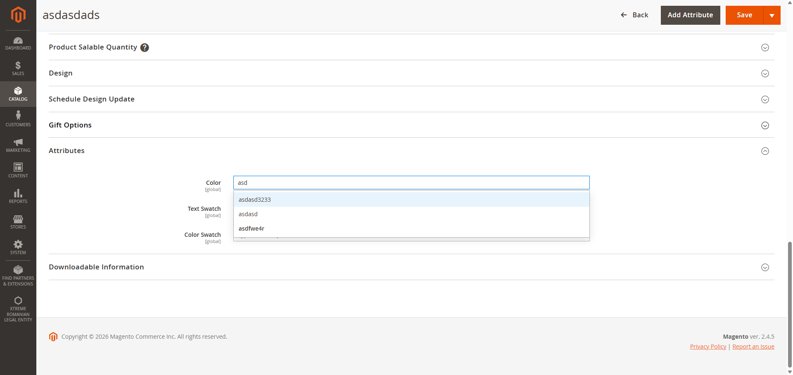
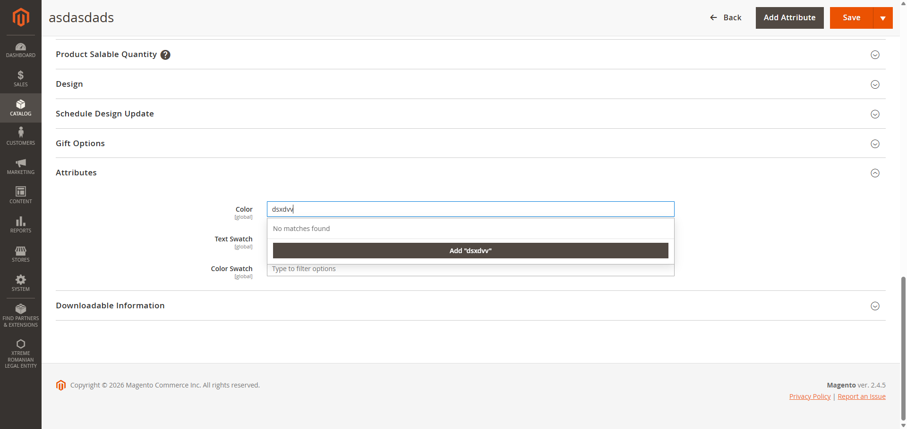
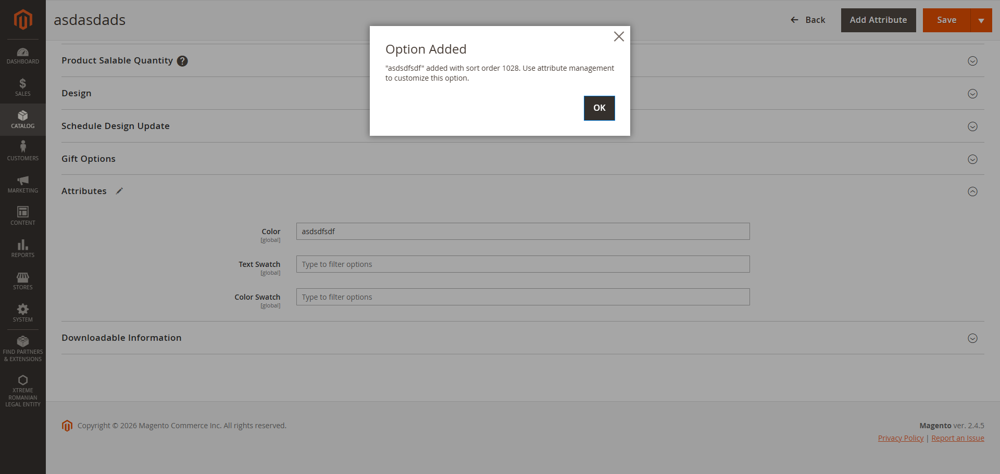

# Magento 2 Attribute Filtering

This module converts dropdown attributes to filterable fields for dropdown, visual swatch and text swatch attributes with large options. It displays an intput box in which a filter can be typed and the dropdown is filtered live. If a value can not be found the module will allow the user to add it to the options list without leaving the product edit/add page.

See screenshots:

